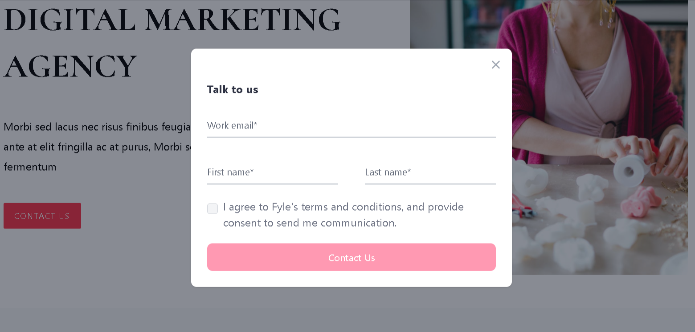
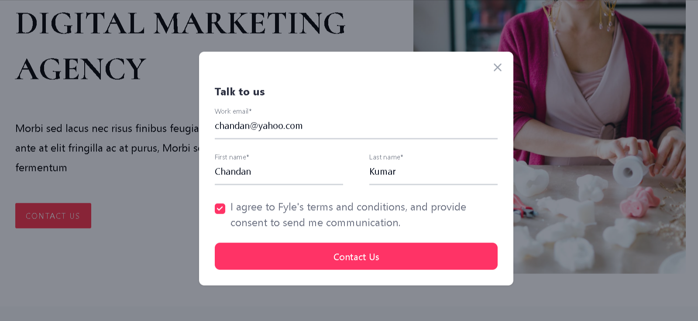
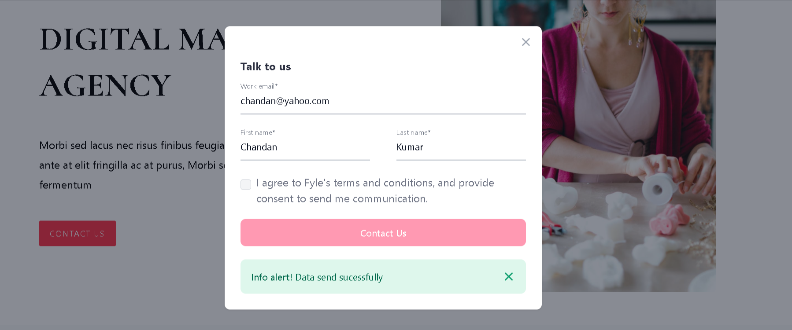
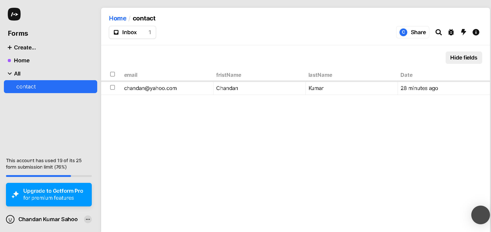
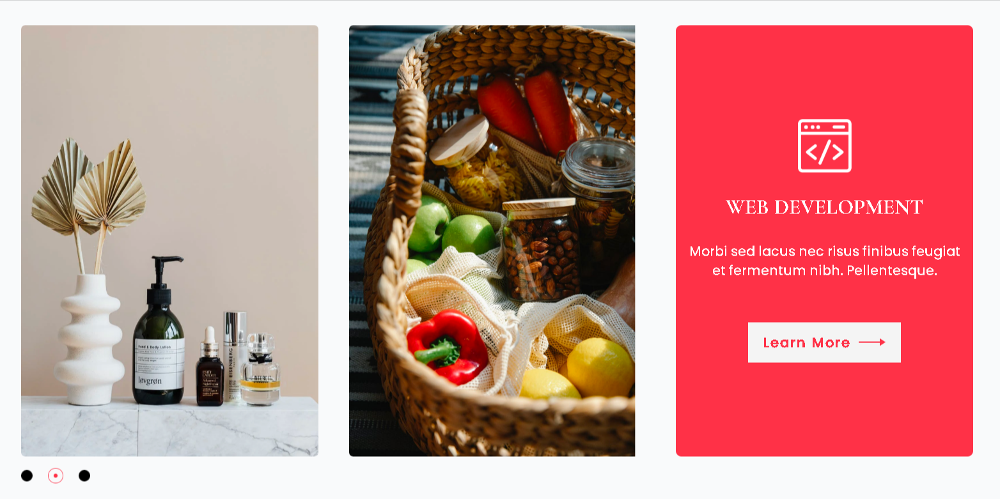

# React Assignment Project

This project is a digital marketing agency landing page built using React. The page is styled with Tailwind CSS, Bootstrap, and Flowbite, and includes several interactive features such as a contact form pop-up and an image slider.

## Project Setup

### Prerequisites

- Node.js
- npm (or yarn)

### Installation

1. Clone the repository:

```bash
git clone https://github.com/Chandan8018/Fyle_Assignment.git
cd Fyle_Assignment
```

2. Install dependencies:

```bash
npm install
```

### Running the Project

To start the development server, run:

```bash
npm run dev
```

This will start the React app at `http://localhost:5173`.

## Technologies Used

- **React**: JavaScript library for building user interfaces
- **Tailwind CSS**: Utility-first CSS framework
- **Bootstrap**: CSS framework for responsive design
- **Flowbite**: Tailwind CSS components library

## Features

### Contact Us Pop-Up Form

- The "Contact Us" button is clickable and opens a pop-up form.
- The form is designed using Flowbite and Tailwind CSS.
- Upon submitting the form, the data is sent to [getform.io](https://getform.io).
- Contact Us Empty Pop-Up Page

---
- Contact Us Data Fillup Pop-Up Page

---
- Contact Us Data Send Pop-Up Page

---
- Recived Data on app.getform.io

---

### Image Slider

- The page includes an image slider with images sliding from left to right.
- The 3 dots at the bottom right of the slider change accordingly as the images slide.
- Slider Page

---

## Demo
- Home Page

---

## File Structure

```plaintext
.
├── public
|   └── repo image
├── src
│   ├── assets
│   │   └── all image
│   ├── components
│   │   ├── ChooseUs.jsx
│   │   ├── Company.jsx
│   │   ├── Feedback.jsx
│   │   ├── Footer.jsx
│   │   ├── HeroSection.jsx
│   │   ├── OurProject.jsx
│   │   ├── Services.css
│   │   └── Services.jsx
│   ├── pages
│   │   ├── ContactUs.jsx
│   │   └── Home.jsx
│   ├── data
│   │   └── data.js
│   ├── App.jsx
│   ├── App.css
│   ├── index.css
│   └── main.jsx
|
├── .eslintrc.cjs
├── .gitignore
├── index.html
├── package-lock.json
├── package.json
├── package.json
├── postcss.config.js
├── README.md
├── tailwind.config.js
└── vite.config.js
```

## How to Use

1. **Contact Us Pop-Up Form**:
    - Click on the "Contact Us" button to open the form.
    - Fill in the details and submit.
    - The form data will be sent to [getform.io](https://getform.io).

2. **Image Slider**:
    - The images will slide automatically from left to right.
    - Use the dots at the bottom right to navigate through the images.

## Contributing

Contributions are welcome! Please feel free to submit a pull request or open an issue.

---

Feel free to contact us if you have any questions or suggestions!
